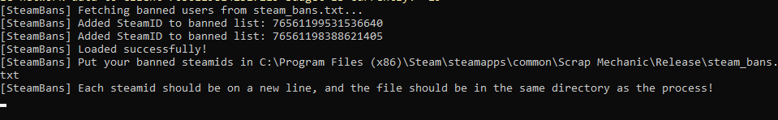
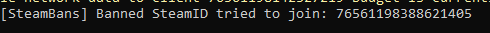
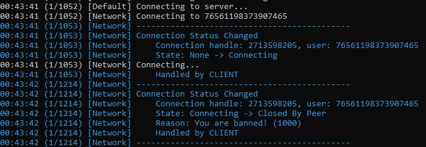

# Steam-Bans
Prevent specific SteamID64's from connecting to your game!

> SteamBans on load-up in -dev console.

> Notification when SteamBans prevented banned SteamID from joining.

> Banned player received a message in their -dev console saying `You are banned!`.

## Usage
To use Steam-Bans, follow these steps:

1. Download the `SteamBans.zip` folder from [GitHub](https://github.com/Scrap-Mods/Steam-Bans/releases/tag/v1.0.0).
2. Install QMark's DLL Loader by following the instructions provided on [his Repo](https://github.com/QuestionableM/SM-DLL-Injector).
3. Put the `SteamBans.dll` file into Scrap Mechanic's game exe directory, specifically into a folder called "DLLModules" (which should be created by QMark's installer).
4. Edit the `steam_bans.txt` file in the game's directory to add more SteamID64's to the ban list and prevent them from connecting.

